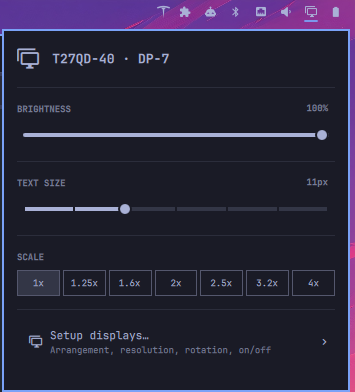

# Displays

Arrange multiple monitors and set scale, resolution, refresh rate and rotation
per monitor in Omarchy.


## Install

```bash
omarchy plugin add https://github.com/kimm-stensborg/omarchy-displays.git
omarchy plugin enable io.github.kimm-stensborg.displays --section right --after omarchy.monitor
```

On first start it takes over `~/.config/hypr/monitors.lua`, and nothing on
screen changes. Your old file is kept next to it as `monitors.lua.bak.<timestamp>`.
It also takes Omarchy's own Display widget off the bar, once, since it does the
same job. Put that widget back and it stays there.

To open it with `SUPER + CTRL + D`, add this to `~/.config/hypr/bindings.lua`:

```lua
hl.unbind("SUPER + CTRL + D")
o.bind("SUPER + CTRL + D", "Displays", "omarchy-shell io.github.kimm-stensborg.displays toggle")
```

## Use



- **The bar popup** has brightness, text size and scale for the monitor you're on.
- **Setup displays**, opened from the popup or **Setup → Displays** in the Omarchy
  menu, is where you drag monitors into place. It also sets scale, resolution,
  refresh rate, rotation, and which monitors are on.
  - Each monitor's box shows what's on that screen, and pointing at a box
    lights up the real screen, so identical monitors can't be mixed up.
  - A ghost shows where a dragged monitor will land, and gaps between monitors
    can't happen.
  - Each monitor has its own brightness, and can mirror another.
  - After **Apply** you have 15 seconds to keep the change. Otherwise it
    reverts, so a bad setting can't lock you out.

Scale changes made elsewhere, like Omarchy's `SUPER + /`, are kept too — on an
external monitor. On the laptop panel they are not: Omarchy syncs that panel to
whatever `monitors.lua` says within a second of any monitor change, so it goes
straight back. Change that one from here. Each set
of monitors keeps its own layout: unplug the laptop from your desk and plug it
back in, and the desk comes back just as you left it. Plug in a monitor it has
never seen, and a notification offers to place it.

It all works from the keyboard: `h` `j` `k` `l` to move around,
`Shift` + `H` `J` `K` `L` to move a monitor, `Enter` to choose, `Esc` to close.

## Update

```bash
omarchy plugin update io.github.kimm-stensborg.displays
omarchy-restart-shell
```

## Remove

```bash
omarchy plugin enable omarchy.monitor --section right
omarchy plugin remove io.github.kimm-stensborg.displays
```

Your layout stays in `monitors.lua` and keeps working.

---

Requires Omarchy 4 with Hyprland's Lua config. MIT licensed.
