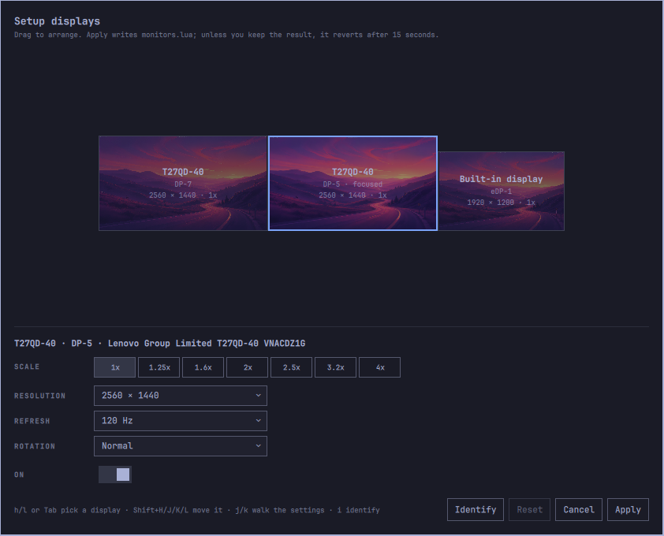

# Displays

Arrange displays, and set scale, resolution, refresh rate and rotation per
display, in a way that is persisted and stays that way. Displays replaces
Omarchy's built-in Display panel (`omarchy.monitor`). It has the same bar popup,
plus a drag canvas for the arrangement.



- **Plugin ID:** `io.github.kimm-stensborg.displays`
- **Kinds:** `bar-widget`, `overlay`, `service`
- **License:** MIT
- **Requires:** Omarchy 4 (Quattro) with `omarchy-shell`, Hyprland with Lua config

## Why it exists

The built-in panel's bugs come from its design, and can't be fixed in place:

1. **The persistence write is what reverts the change.** `omarchy-hyprland-monitor-scaling`
   applies the scale live with `hyprctl eval`, then `sed`s `monitors.lua`.
   Saving that file makes Hyprland reload, and the reload re-applies the
   declared rules. That undoes the live change a few seconds after the click.
2. **It persists one shared value.** `omarchy_monitor_scale` is read only by
   the catch-all rule, so it can't hold a different scale per display.
3. **It applies with `position = "auto"`.** That parks a rescaled display at
   the right-hand end of the row and scrambles the arrangement.
4. **Arrangement is unreachable.** `omarchy-monitor-state` never selects `x`
   or `y`, and there is no control for position, mode, refresh rate, rotation or
   primary.
5. **Switching a display off doesn't survive a restart.** It is
   `hyprctl keyword monitor NAME,disable`, which is never written anywhere.

Displays turns the order around: **it persists first, and lets the reload
apply.** It writes a managed block into `~/.config/hypr/monitors.lua`, and
that write *is* the apply step: Hyprland reloads on save and applies the whole
config at once. A change that has been written can't be reverted by the
reload that follows it. No committed change is applied live.

## Install

```bash
omarchy plugin add https://github.com/kimm-stensborg/omarchy-displays.git
omarchy plugin enable io.github.kimm-stensborg.displays --section right --after omarchy.monitor
omarchy plugin disable omarchy.monitor
```

Plugins land disabled so the code can be read before it runs. They execute
unsandboxed inside `omarchy-shell`.

On its first start the plugin takes over `monitors.lua`:

- It keeps the file's opening comment header.
- It replaces the rest with a managed block that describes exactly what
  Hyprland is showing at that moment, so nothing on screen moves.
- It saves the old file next to it as `monitors.lua.bak.<timestamp>`.
- It adds **Setup → Displays** to the Omarchy menu.
- If the old `omarchy-monitor-scale-persist` user service exists, it disables
  it.

Every step is a no-op once done.

To have `SUPER + CTRL + D` open the Displays popup instead of the built-in
panel, add this to `~/.config/hypr/bindings.lua`:

```lua
-- Displays popup (io.github.kimm-stensborg.displays)
hl.unbind("SUPER + CTRL + D")
o.bind("SUPER + CTRL + D", "Displays", "omarchy-shell io.github.kimm-stensborg.displays toggle")
```

This calls the popup's own IPC target rather than `omarchy-shell shell toggle`.
The shell routes `summon` and `toggle` for a plugin that also has an overlay
to that overlay, so `omarchy-shell shell toggle io.github.kimm-stensborg.displays`
opens Arrange displays instead.

Every monitor's bar has its own copy of the widget. Only the copy on the
focused screen holds the IPC target, so the popup opens on the screen you're
looking at.

## Update

```bash
omarchy plugin update io.github.kimm-stensborg.displays
omarchy-restart-shell
```

The shell notices the changed files and says it reloads the plugin, but it
re-creates the plugin from the QML it has already compiled. The new code only
runs after a restart.

## Remove

```bash
omarchy plugin enable omarchy.monitor --section right --before io.github.kimm-stensborg.displays
omarchy plugin remove io.github.kimm-stensborg.displays
```

The managed block stays in `monitors.lua` and keeps working. It is plain
Hyprland Lua. Delete the markers and everything between them to hand the file
back, or restore the `.bak`.

## The bar popup

It offers everything the built-in panel did, in the same order, with the same
keys:

- **Brightness**: the focused display's backlight, through
  `omarchy-brightness-display`. The scroll wheel on the bar icon changes it too.
- **Text size**: the shell and GTK text size, through `omarchy-display-text-size`.
- **Scale**: 1, 1.25, 1.6, 2, 2.5, 3.2 and 4, adjusted for the focused
  display's mode (see below).
  - It always names the display it targets.
  - It **only ever changes the focused display**. To scale another display,
    focus it or use Arrange displays.
- **Displays**: turn displays on or off. The last display that is on can't be
  turned off.
  - An external display is written into the block as `disabled = true`, so it
    stays off across restarts.
  - The laptop panel goes through Omarchy's own toggle
    (`omarchy-hyprland-monitor-internal`), because clamshell turns a `disabled`
    rule for the internal panel straight back on.
- **Arrange displays…** opens the canvas.

| Key | Action |
|-----|--------|
| `j` `k` / arrows | move between rows |
| `h` `l` / arrows | adjust a slider, or walk the scale row |
| `Enter` / `Space` | apply the scale under the cursor, toggle a display, open Arrange |
| `a` | open Arrange displays |
| `Tab` | next bar popup |
| `Esc` | close |

## Arrange displays

Each display is drawn at its **logical** size: physical size, rotated, divided
by scale. That is the size Hyprland lays it out at, so changing a scale
visibly shrinks the box, and any gap it would open is visible before
anything is written.

- While you drag, a **ghost** shows where the display will land, and the
  others slide aside to make room.
  - Over another display, it goes beside that one, on whichever side of it
    you're over, and whatever is further along that side moves over.
  - Over open space, it lines up with nearby edges and attaches to the
    nearest free edge.
- A **gap or an overlap is impossible**: whatever a move leaves behind closes
  up. Hyprland would accept either, but a gap is a wall the pointer can't
  cross. Apply still checks, as a backstop.
- The selected display has **scale** (the same presets), **resolution**,
  **refresh rate**, **rotation** (all eight transforms) and **on/off**.
  Changing any of them re-derives the arrangement around it.

**Apply → confirm → auto-revert.** Displays are the one setting that can leave
the machine unusable, so Apply comes with a way back:

1. The file as it was is saved to `~/.local/state/omarchy/displays.json`, then
   the new block is written, and Hyprland reloads.
2. A countdown appears on *every* screen that exists after the reload, not
   only the one the editor was on.
3. **Keep** confirms the change. **Revert**, `Esc`, or letting 15 seconds pass
   restores the previous file.

The deadline is also enforced by a detached watchdog process, and at the next
shell start, so a crash in the middle still ends in the old layout.

| Key | Action |
|-----|--------|
| `h` `l` / `Tab` | pick a display |
| `Shift` + `H` `J` `K` `L` | move it past its neighbour in that direction |
| `j` `k` | walk scale, resolution, refresh, rotation, on/off, buttons |
| `h` `l` on a setting | cycle through its values |
| `Enter` | apply the scale under the cursor, toggle on/off, press a button |
| `Esc` | close without applying |

## Scale

Hyprland stores scale in 1/120 steps. A scale `s` is valid for a `w×h` mode
exactly when `k = round(s × 120)` divides `g = gcd(120w, 120h)`. In other
words, the logical size comes out whole on both axes. Any requested scale is
clamped to `g/120` and rounded **up** to the next valid one, never down.

Displays offers seven presets: 1, 1.25, 1.6, 2, 2.5, 3.2 and 4.
- On a mode where a preset isn't valid, it's offered as the scale it rounds
  up to.
- A current scale that isn't one of them (set from a terminal, say) is shown
  too, so the active one is always visible.

| Mode | Offered |
|------|---------|
| 2560×1440 | 1, 1.25, 1.6, 2, 2.5, 3.2, 4 |
| 1920×1200 | 1, 1.25, 1.6, 2, 2.5, 3.2, 4 |
| 1920×1080 | 1, 1.25, 1.6, 2, 2.5, 3.3333, 4 (3.2 isn't valid, so it rounds up) |

`GDK_SCALE` is a single whole number for the whole session, and GTK ignores
fractions. Displays sets it to `int(s + 0.5)` of the lowest-scaled display
that is on, so GTK apps are never oversized on the plain screens.

## The managed block

```lua
-- >>> displays managed -- do not edit by hand
-- Written by the Displays plugin. Change it from the Displays bar popup or
-- Arrange displays; anything between these markers is replaced on the next change.
local gdk_scale = 1
local fallback_scale = "auto"
hl.env("GDK_SCALE", tostring(gdk_scale))
-- Lenovo Group Limited T27QD-40 VNACDZ5V
hl.monitor({ output = "desc:Lenovo Group Limited T27QD-40 VNACDZ5V", mode = "2560x1440@120", position = "0x0", scale = 1 })
-- Lenovo Group Limited T27QD-40 VNACDZ1G
hl.monitor({ output = "desc:Lenovo Group Limited T27QD-40 VNACDZ1G", mode = "2560x1440@120", position = "2560x0", scale = 1.25 })
-- eDP-1 (built-in display)
hl.monitor({ output = "eDP-1", mode = "1920x1200@60", position = "4608x0", scale = 1 })
-- Anything not named above is placed automatically
hl.monitor({ output = "", mode = "preferred", position = "auto", scale = fallback_scale })
-- <<< displays managed
```

Everything outside the markers is preserved byte for byte. The block's shape
is strict, because two Omarchy scripts read this file with line-oriented `sed`.
`monitors.py` refuses to write any block that breaks one of these rules:

- **One `hl.monitor({` per line, at column 0.** That is what clamshell's rule
  regex matches.
- **The laptop panel is matched by its connector (`output = "eDP-1"`).** Every
  Omarchy helper finds the internal panel by its `eDP`/`LVDS`/`DSI` prefix.
- **External displays are matched by `desc:` including the serial.**
  Identical panels trade connector names between boots.
- **`position` is a literal string.** Clamshell can't evaluate
  `a .. "x0"`; it falls back to `auto` and misplaces the panel when the lid
  opens.
- **`scale` is a plain number or a name.** No exponents, and no leading or
  trailing dot.
- **The catch-all's scale is a name (`fallback_scale`), and there's no
  `omarchy_monitor_scale` or `omarchy_gdk_scale` local at column 0.** Either
  one would match `omarchy-hyprland-monitor-scaling`'s persistence check. Its
  `sed` would then rewrite the file and set off the reload that reverts the
  change.
- **`GDK_SCALE` is set through `tostring()`.** The literal-string form is
  what that script's `GDK_SCALE` `sed` rewrites.
- **No `--` inside a string, and no `--[[ ]]` comments.** Clamshell strips
  comments before it knows where strings are, and doesn't strip multi-line
  comments at all.
- **A write that changes nothing doesn't touch the file.** Every write
  reloads Hyprland, and clamshell polls every two seconds.

The file is written atomically: to a temporary file beside the real one
(behind any dotfile symlink), `fsync`ed, then renamed over it.

## Out-of-band scale changes

`omarchy-hyprland-monitor-scaling` is still bound to `SUPER + /` and still in
the Omarchy menu. It applies a scale live and never writes it down, because
its `sed` doesn't match a managed block. Left alone, the next reload would undo
it quietly, and its `position = "auto"` has already moved the display out of
the row.

The service (`Reconcile.qml`) watches for exactly this:

- It wakes on Hyprland's monitor events and on a slow poll.
- When a display's live scale disagrees with the block, it looks again after
  1.5 s.
- If the difference is still there, and no write of its own is still landing,
  it writes the new scale into the block. It re-derives the arrangement from
  the declared layout, not the scrambled live one.
- The reload that write causes puts every display back where the block says.
- The script parks the display with `position = "auto"` even when the scale
  it sets is already the one in place. That kind of drift needs nothing
  written down, since the block is already right, so the service runs
  `hyprctl reload`.
- Mirrored displays are left alone. Omarchy's mirror toggle puts them
  somewhere the block doesn't say, on purpose.
- If Hyprland still doesn't take the declared layout after one attempt, the
  service leaves that exact state alone until something changes, rather than
  reloading in a loop.

## What it remembers

| Path | What |
|------|------|
| `~/.config/hypr/monitors.lua` | the managed block, the only store of the layout |
| `~/.config/hypr/monitors.lua.bak.<timestamp>` | the file as it was before the first start |
| `~/.local/state/omarchy/displays.json` | the undo snapshot for the last Apply, and whether it was kept |
| `~/.local/state/omarchy-displays/menu-entry` | that the menu row has been added once, so deleting it sticks |

There is no `~/.config/omarchy/displays.json`. `monitors.lua` is the store.

## Files

| File | Role |
|------|------|
| `Displays.qml` | bar widget: button and popup |
| `Arrange.qml` | overlay: the drag canvas and the confirm countdown |
| `Reconcile.qml` | service: first-start setup, and recording out-of-band scale changes |
| `Layout.js` | all the pure logic: scale ladder, arrangement, snapping, block rendering and parsing |
| `monitors.py` | reads and validates the managed block, and writes it atomically; confirm, revert, watchdog |
| `test.js`, `test.qml` | tests |

## Tests

```bash
node test.js      # Layout.js, the block against clamshell's own sed, monitors.py end to end
qml6 test.qml     # Layout.js under QML's V4 engine (exit code only)
```

`test.js` runs the clamshell functions copied verbatim from
`omarchy-hyprland-monitor-clamshell` under bash, and checks the file with
`omarchy-hyprland-monitor-scaling`'s own grep patterns. So "clamshell can read
the laptop's position" is tested against clamshell itself, not a guess at it.
It drives `monitors.py` through a scratch directory. It covers adoption, the
no-op write, confirm, revert, recovery after a missed deadline, and the
watchdog.
